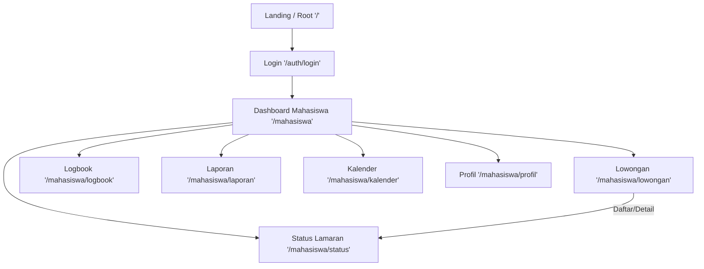

# 📘 Guideline Design — Vokasi Magang Frontend

> Dokumen ini berisi panduan lengkap desain, arsitektur, dan alur website **Vokasi Magang** agar setiap pengembang (atau model AI) dapat memahami dan melanjutkan pengembangan dengan konsisten.

---

## 1. Tech Stack

| Teknologi | Versi / Detail |
|---|---|
| **Framework** | React 19 + TypeScript |
| **Build Tool** | Vite 8 |
| **Routing** | react-router-dom v7 (`BrowserRouter` + `Routes`) |
| **Styling** | Tailwind CSS v4 (via `@tailwindcss/vite` plugin) |
| **UI Library** | shadcn/ui v4 (style: `base-nova`, tanpa RSC) |
| **Icon** | Lucide React + React Icons |
| **Font** | Geist Variable (`@fontsource-variable/geist`) |
| **Utility** | clsx, tailwind-merge, class-variance-authority (CVA) |
| **Animasi** | tw-animate-css |

### Cara Menjalankan

```bash
npm install
npm run dev      # development server
npm run build    # production build (tsc + vite build)
```

---

## 2. Struktur Proyek

```
FrontEnd-website/
├── public/
│   ├── Profiles/          # Foto profil user
│   ├── lowongans/         # Gambar lowongan magang
│   ├── favicon.svg
│   └── icons.svg
├── src/
│   ├── assets/            # Asset statis (hero.png, dll)
│   ├── components/        # Komponen reusable (custom)
│   │   ├── ui/            # Komponen shadcn/ui (Badge, Button, Select)
│   │   ├── Button.tsx     # Custom Button (berbeda dari shadcn)
│   │   ├── Card.tsx
│   │   ├── DashboardHeader.tsx
│   │   ├── Input.tsx
│   │   ├── LaporanCard.tsx
│   │   ├── LowonganCard.tsx
│   │   ├── Navlink.tsx
│   │   ├── Notification.tsx
│   │   ├── ProgressLamaran.tsx
│   │   ├── Select.tsx     # Custom Select (berbeda dari shadcn)
│   │   └── StatusCard.tsx
│   ├── layouts/
│   │   └── DashboardLayout.tsx   # Layout utama dashboard (sidebar + header)
│   ├── lib/
│   │   └── utils.ts       # cn() shadcn (clsx + twMerge)
│   ├── pages/
│   │   └── Auth/
│   │       ├── Login.tsx          # Halaman login (belum diimplementasi)
│   │       └── Mahasiswa/
│   │           ├── Dashboard.tsx
│   │           ├── LowonganPage.tsx
│   │           ├── StatusPage.tsx
│   │           ├── LogbookPage.tsx
│   │           ├── LaporanPage.tsx
│   │           ├── ProfilePage.tsx
│   │           └── KalenderPage.tsx
│   ├── utils/
│   │   └── cn.ts          # cn() custom (clsx saja, tanpa twMerge)
│   ├── App.tsx            # Halaman root "/" (duplikat konten Dashboard)
│   ├── App.css            # CSS khusus landing/hero (tidak dipakai di dashboard)
│   ├── index.css          # Global CSS + Tailwind + shadcn theme
│   └── main.tsx           # Entry point + routing
├── components.json        # Konfigurasi shadcn/ui
├── package.json
├── tsconfig.json
└── vite.config.ts
```

### Catatan Penting

- Ada **2 fungsi `cn()`**:
  - `src/utils/cn.ts` → hanya `clsx` (dipakai oleh komponen custom: Card, Button, Input, Navlink)
  - `src/lib/utils.ts` → `clsx` + `twMerge` (dipakai oleh komponen shadcn/ui)
- Komponen di `src/components/` adalah **custom buatan sendiri**.
- Komponen di `src/components/ui/` adalah dari **shadcn/ui** (jangan dimodifikasi manual).

---

## 3. Routing & Alur Navigasi

### Definisi Route (di `main.tsx`)

```
/                           → App.tsx (halaman root, konten dashboard)
/auth/login                 → LoginPage (placeholder)
/mahasiswa                  → DashboardLayout (layout wrapper)
  ├── /mahasiswa             → DashboardPage (index)
  ├── /mahasiswa/profil      → ProfilePage
  ├── /mahasiswa/lowongan    → LowonganPage
  ├── /mahasiswa/laporan     → LaporanPage
  ├── /mahasiswa/status      → StatusPage
  ├── /mahasiswa/logbook     → LogbookPage
  └── /mahasiswa/kalender    → KalenderPage
```

### Alur User (Flow)



### Pola Route Dosen (sudah didefinisikan di DashboardLayout, belum diimplementasi)

```
/dosen                      → Dashboard Dosen
/dosen/mahasiswa-bimbingan   → Mahasiswa Bimbingan
/dosen/monitoring-logbook    → Monitoring Logbook
/dosen/report                → Laporan
/dosen/penilaian-magang      → Penilaian Magang
```

---

## 4. Layout Sistem

### DashboardLayout (`src/layouts/DashboardLayout.tsx`)

Layout utama yang membungkus semua halaman di bawah route `/mahasiswa`. Terdiri dari 3 bagian:

```
┌─────────────────────────────────────────────────────────┐
│  HEADER (fixed top, bg-white, z-50)                     │
│  ┌──────────┐                        ┌─────────────┐    │
│  │ Vokasi   │                        │🔔 👤 Nama   │    │
│  │ Magang   │                        │   Prodi     │    │
│  └──────────┘                        └─────────────┘    │
├────────────┬────────────────────────────────────────────┤
│  SIDEBAR   │  CONTENT AREA                              │
│  (fixed    │  (bg-[#F3F4F6], pt-21, pl-55)              │
│  w-50,     │                                            │
│  bg-white) │  <Outlet /> ← halaman page dirender di sini│
│            │                                            │
│  📊 Dashboard│                                          │
│  💼 Lowongan │                                          │
│  📋 Status   │                                          │
│  📖 Logbook  │                                          │
│  📄 Laporan  │                                          │
│  📅 Kalender │                                          │
│  ──────────│                                            │
│  ⚙️ Setting  │                                          │
│  🚪 Logout   │                                          │
├────────────┴────────────────────────────────────────────┤
```

**Properti penting:**
- Header: `fixed top-0`, `py-3`, `z-50`
- Sidebar: `fixed`, `w-50`, `h-screen`, `pt-21` (setelah header)
- Content: `pl-55` (offset sidebar), `pt-21` (offset header), `px-6`, `pb-20`, `space-y-8`
- Background halaman: `bg-[#F3F4F6]` (abu muda)

---

## 5. Design System

### 5.1 Warna

#### Warna Utama (Brand)

| Nama | Hex | Penggunaan |
|---|---|---|
| **Blue Primary** | `#4769B1` | Heading section, label form, judul profil |
| **Blue 500** | `text-blue-500` | Logo "Vokasi Magang", ikon nav aktif |
| **Blue 800** | `text-blue-800` | Heading dashboard, teks Card default, nama user |
| **Blue 200** | `bg-blue-200` | Progress bar fill |
| **Blue 300** | `bg-blue-300` | Icon container (kotak ikon di card) |

#### Warna Status

| Status | Background | Text | Contoh |
|---|---|---|---|
| **Sukses / Diterima** | `bg-[#DCFCE7]` atau `bg-green-200` | `text-[#016630]` atau `text-green-800` | Badge "Validasi Selesai", "Diterima" |
| **Sukses ikon** | — | `text-[#00C950]` atau `text-green-500` | CheckCircle icons |
| **Warning / Pending** | `bg-[#F9FAFB]` | `text-[#6B7280]` | Badge "Pending" |
| **Info / Notifikasi** | `bg-[#EFF6FF]` | `text-[#2B7FFF]` | Notifikasi terbaru, feedback box |
| **Danger / Ditolak** | `bg-red-100` | `text-red-500` | Deadline di kalender, jumlah ditolak |
| **Orange** | — | `text-[#FF6900]` | Ikon pengingat logbook |

#### Warna Netral

| Nama | Hex / Class | Penggunaan |
|---|---|---|
| **Background Page** | `bg-[#F3F4F6]` atau `bg-[#F4F5F7]` | Background area konten |
| **Card Background** | `bg-white` | Semua card |
| **Border** | `border-[#E5E7EB]` atau `border-black/30` | Border card, input, divider |
| **Teks Utama** | `text-black` atau `text-[#1F2937]` | Judul item, nama posisi |
| **Teks Sekunder** | `text-[#4A5565]` atau `text-[#6B7280]` | Deskripsi, sub-info, timestamp |
| **Teks Muted** | `text-gray-500` atau `text-[#5B6B88]` | Label statistik, keterangan |
| **Input BG** | `bg-[#F3F3F5]` atau `bg-[#F8F9FB]` | Background field input |

### 5.2 Tipografi

- **Font Family**: `'Geist Variable', sans-serif` (diimpor via `@fontsource-variable/geist`)
- **Heading halaman**: `text-4xl font-bold` (contoh: "Selamat Datang Keisya Lanika")
- **Heading section** (di kalender/logbook): `text-[28px] font-bold` atau `text-xl font-semibold`
- **Sub-heading card**: `text-xl` atau `text-lg font-medium`
- **Body text**: `text-sm` (14px)
- **Caption / timestamp**: `text-xs` (12px)
- **Label form**: `text-[14px] font-medium`
- **Angka statistik besar**: `text-4xl font-semibold` atau `text-[28px] font-bold`

### 5.3 Spacing & Radius

- **Card padding**: `p-5` (20px) atau `p-6` (24px)
- **Gap antar card**: `gap-6` (24px) atau `gap-7.5` (30px)
- **Space antar section** (dalam layout): `space-y-8` (32px)
- **Card radius**: `rounded-xl` (12px) adalah default, `rounded-[24px]` atau `rounded-[28px]` untuk card besar
- **Button radius**: `rounded-sm` (custom Button), `rounded-sm` (shadcn Button)
- **Input radius**: `rounded-lg` (8px) atau `rounded-xl` (12px)
- **Badge radius**: `rounded-2xl` (16px) atau `rounded-full`

### 5.4 Ikon

Semua ikon menggunakan **Lucide React**. Pola penggunaan:

```tsx
import { Home, BriefcaseBusiness, Calendar } from "lucide-react";

// Default size
<Home />              // 24px default

// Custom size
<Calendar size={14} /> // untuk caption
<MapPin size={18} />   // untuk info detail
<Icon size={18} />     // dalam NavLink container
```

**Ikon container** (kotak ikon di card):
```tsx
<div className="aspect-square size-12 bg-blue-300 rounded-md flex items-center justify-center">
  <Building2 className="text-blue-60" />
</div>
```

---

## 6. Komponen Library

### 6.1 Card

**File**: `src/components/Card.tsx`

Kartu putih dasar yang membungkus konten. Digunakan di hampir semua halaman.

```tsx
<Card className="optional-extra-classes">
  {children}
</Card>
```

**Default style**: `bg-white rounded-xl w-full p-5 text-blue-800 space-y-2`

### 6.2 Button (Custom)

**File**: `src/components/Button.tsx`

```tsx
<Button variant="primary">Primary</Button>      // bg-black text-white
<Button variant="outline">Outline</Button>       // bg-white border text-black
<Button variant="destructive">Delete</Button>    // bg-red-500 text-white

<Button size="sm">Small</Button>                 // px-2 py-1 text-sm
<Button size="regular">Regular</Button>          // px-4 py-1.5
<Button size="lg">Large</Button>                 // px-4 py-2.5
```

**Catatan**: Ada juga `src/components/ui/button.tsx` (shadcn). Keduanya dipakai di tempat berbeda. Shadcn Button punya lebih banyak variant: `default`, `outline`, `secondary`, `ghost`, `destructive`, `link`.

### 6.3 DashboardHeader

**File**: `src/components/DashboardHeader.tsx`

Header judul dan deskripsi untuk setiap halaman dalam dashboard.

```tsx
<DashboardHeader
  title="Judul Halaman"                    // text-4xl font-bold text-blue-800
  description="Deskripsi singkat halaman"   // text-blue-800
/>
```

### 6.4 Input

**File**: `src/components/Input.tsx`

Input field dengan dukungan prefix/suffix icon.

```tsx
<Input
  prefixIcon={Search}
  placeholder="Cari sesuatu..."
/>
```

**Style**: `px-4 py-1.5 border border-black/30 rounded-lg bg-[#F3F3F5]`

### 6.5 NavLink

**File**: `src/components/Navlink.tsx`

Item navigasi di sidebar. Mendeteksi halaman aktif berdasarkan `window.location.pathname`.

```tsx
<NavLink label="Dashboard" icon={Home} href="/mahasiswa" />
```

**Aktif**: `bg-[#BDD8E9] text-[#5A5A55]`, ikon container: `text-white`
**Tidak aktif**: `text-black`, ikon container: `text-blue-500`
**Ikon container**: `size-8 shadow-sm rounded-full bg-[#A7A7A5]/30`

### 6.6 Notification

**File**: `src/components/Notification.tsx`

Dropdown notifikasi yang ditoggle via ikon Bell. Muncul di header.

- Trigger: `<Bell />` icon
- Dropdown: `absolute right-0, w-xs, bg-white, border, z-50`
- Backdrop: overlay fullscreen transparan untuk menutup dropdown

### 6.7 LowonganCard

**File**: `src/components/LowonganCard.tsx`

Card berisi informasi lowongan magang. Digunakan di halaman Lowongan.

**Struktur**:
- Icon container (Building2) + Badge tipe (Full-time)
- Nama posisi + Perusahaan
- Deskripsi singkat
- Lokasi (MapPin) + Deadline (Clock4)
- Button "Daftar" (flex-4) + Button "Detail" (flex-1, outline)

### 6.8 StatusCard

**File**: `src/components/StatusCard.tsx`

Card tracking progress lamaran. Berisi timeline vertikal.

**Struktur**:
- Header: Icon + Nama posisi + perusahaan + tanggal dilamar
- Badge status (Diterima/Ditolak/Review)
- Timeline progress: ProgressLamaran × 4 step
- Divider
- Action buttons: "Lihat Berkas" + "Mulai Magang"

### 6.9 LaporanCard

**File**: `src/components/LaporanCard.tsx`

Card untuk menampilkan laporan yang sudah disubmit.

**Struktur**:
- Header: FileText icon + judul laporan + tanggal submit + Badge nilai
- File attachment box: nama file + Unduh + Preview buttons
- Feedback box: border-left biru, bg-[#EFF6FF], komentar dosen
- Nilai akhir box: bg-[#DCFCE7], angka besar

### 6.10 ProgressLamaran

**File**: `src/components/ProgressLamaran.tsx`

Item tunggal dalam timeline progress lamaran.

```tsx
<ProgressLamaran status="Pengajuan Berkas" />
```

Step yang tersedia: Pengajuan Berkas → Verifikasi Admin → Seleksi Perusahaan → Diterima

---

## 7. Halaman-Halaman

### 7.1 Dashboard (`/mahasiswa`)

**File**: `src/pages/Auth/Mahasiswa/Dashboard.tsx`

**Konten**:
1. `DashboardHeader` — sapaan personal + deskripsi
2. `Card` — Progress Magang (progress bar 50%, sisa hari)
3. Grid 3 kolom:
   - Status Pendaftaran (CheckCircle hijau + badge sukses)
   - Pengingat Logbook (Clock4 oranye + tanggal terakhir + tombol)
   - Notifikasi Terbaru (Bell biru + 2 notifikasi)
4. `Card` — Lowongan Magang Terbaru (list 3 lowongan dari data, tiap item ada gambar + info + tombol Detail)

### 7.2 Lowongan (`/mahasiswa/lowongan`)

**File**: `src/pages/Auth/Mahasiswa/LowonganPage.tsx`

**Konten**:
1. `DashboardHeader` — "Pencarian Lowongan Magang"
2. `Card` — Filter bar: Input search + 2 Select (Lokasi, Tipe) + info jumlah + Reset Filter
3. Grid 3 kolom — `LowonganCard` × 15

### 7.3 Status (`/mahasiswa/status`)

**File**: `src/pages/Auth/Mahasiswa/StatusPage.tsx`

**Konten**:
1. `DashboardHeader` — "Status Lowongan"
2. Grid 4 kolom — Statistik card: Total Lamaran (3), Diterima (1, hijau), Proses Review (2, biru), Ditolak (3, merah)
3. `StatusCard` × 15 (list)

### 7.4 Logbook (`/mahasiswa/logbook`)

**File**: `src/pages/Auth/Mahasiswa/LogbookPage.tsx`

**Konten** (tidak menggunakan DashboardHeader, layout mandiri):
1. Grid 2 kolom:
   - **Kiri**: Riwayat Logbook — list entry dengan tanggal, aktivitas, status badge (Reviewed/Pending)
   - **Kanan**: Input Logbook Harian — upload foto, date picker, textarea, tombol Simpan + Reset
2. Feedback Dosen — list feedback dengan border-left biru, nama dosen, komentar

### 7.5 Laporan (`/mahasiswa/laporan`)

**File**: `src/pages/Auth/Mahasiswa/LaporanPage.tsx`

**Konten**:
1. `DashboardHeader` — "Laporan Magang"
2. Grid 4 kolom — Statistik (sama pola dengan StatusPage, tapi item terakhir "Nilai Rata-rata: 85")
3. `LaporanCard` × 3

### 7.6 Kalender (`/mahasiswa/kalender`)

**File**: `src/pages/Auth/Mahasiswa/KalenderPage.tsx`

**Konten** (tidak menggunakan DashboardHeader, header mandiri):
1. Header mandiri — "Kalender Magang" + deskripsi
2. Grid 4 kolom — Stats card: Deadline Minggu Ini, Jadwal Magang, Meeting, Hari Tersisa
3. Grid 2 kolom `[1fr_350px]`:
   - **Kiri**: Kalender grid 7 kolom, navigasi bulan, tanggal dengan event labels
   - **Kanan**: Panel agenda untuk tanggal terpilih

### 7.7 Profil (`/mahasiswa/profil`)

**File**: `src/pages/Auth/Mahasiswa/ProfilePage.tsx`

**Konten**:
1. Header: "Edit Profil" + tombol Batal/Simpan (rounded-full, `bg-[#4769B1]`)
2. `Card` — Info profil: foto, nama, NIM, email, universitas, telepon, alamat, 3 badge (Prodi, Semester, IPK)
3. `Card` — Form "Data Pribadi": grid 2 kolom input (Nama, NIM, Email, Telepon) + input Alamat full-width

---

## 8. Pola & Konvensi Kode

### 8.1 Pembuatan Halaman Baru

1. Buat file di `src/pages/Auth/Mahasiswa/[NamaPage].tsx`
2. Export default component
3. Gunakan `DashboardHeader` sebagai header (opsional, tapi konsisten)
4. Gunakan `Card` untuk membungkus setiap section
5. Daftarkan route baru di `main.tsx` di dalam `<Route path="mahasiswa">`

```tsx
// Template halaman baru
import { DashboardHeader } from "../../../components/DashboardHeader";
import { Card } from "../../../components/Card";

const NamaPage = () => {
  return (
    <>
      <DashboardHeader
        title="Judul Halaman"
        description="Deskripsi singkat"
      />
      <Card>
        {/* Konten */}
      </Card>
    </>
  );
};

export default NamaPage;
```

### 8.2 Pembuatan Komponen Baru

1. Buat file di `src/components/[NamaKomponen].tsx`
2. Gunakan `cn()` dari `../utils/cn` untuk conditional classes
3. Terima `className` sebagai prop opsional untuk fleksibilitas
4. Export sebagai named export

```tsx
import { cn } from "../utils/cn";

interface NamaKomponenProps {
  className?: string;
  children?: React.ReactNode;
  // props lainnya
}

export const NamaKomponen = ({ className, children }: NamaKomponenProps) => {
  return (
    <div className={cn("base-classes", className)}>
      {children}
    </div>
  );
};
```

### 8.3 Konvensi Penamaan

| Kategori | Konvensi | Contoh |
|---|---|---|
| File halaman | PascalCase + `Page` suffix | `LowonganPage.tsx`, `StatusPage.tsx` |
| File komponen | PascalCase | `LowonganCard.tsx`, `StatusCard.tsx` |
| File komponen shadcn | kebab-case | `badge.tsx`, `button.tsx` |
| Nama komponen | PascalCase | `LowonganCard`, `DashboardHeader` |
| Props interface | PascalCase + `Props` | `ButtonProps`, `InputProps` |
| Route path | lowercase, kebab-case | `/mahasiswa/lowongan`, `/auth/login` |

### 8.4 Pattern Umum

**Statistik Grid** (digunakan di StatusPage dan LaporanPage):
```tsx
<div className="grid grid-cols-4 gap-15">
  <Card className="rounded-sm flex flex-col justify-center items-center">
    <p className="text-sm text-gray-500">Label</p>
    <p className="text-4xl text-black font-semibold">Angka</p>
  </Card>
  {/* ...repeat */}
</div>
```

**Card dengan icon header** (digunakan di Dashboard):
```tsx
<Card>
  <div className="flex gap-2 items-center">
    <IconComponent className="text-[#WARNA]" />
    <p className="text-lg text-black font-medium">Judul</p>
  </div>
  {/* Konten */}
</Card>
```

**Card dengan icon container + badge** (digunakan di Lowongan, Status):
```tsx
<Card>
  <div className="flex justify-between items-center">
    <div className="aspect-square size-12 bg-blue-300 rounded-md flex items-center justify-center">
      <Building2 className="text-blue-60" />
    </div>
    <Badge variant="outline">Label</Badge>
  </div>
  {/* Detail info */}
</Card>
```

---

## 9. Yang Perlu Diperhatikan (Known Issues)

1. **Halaman Login belum diimplementasi** — hanya render `<div>Login</div>`.
2. **Route Dosen sudah didefinisikan** di `DashboardLayout.tsx` (array `menuDosen`) tapi **belum ada halaman dan routenya**.
3. **App.tsx** berisi konten Dashboard yang duplikat. Route `/` menampilkan konten yang sama dengan `/mahasiswa` tapi tanpa layout.
4. **NavLink menggunakan `<a>` tag** bukan `react-router-dom <Link>`— ini menyebabkan full page reload saat navigasi.
5. **Data masih hardcoded** (tidak ada API call, semua data statis).
6. **Custom `cn()` di `utils/cn.ts`** tidak menggunakan `twMerge` — bisa menyebabkan konflik class Tailwind. Komponen shadcn di `ui/` menggunakan versi yang benar di `lib/utils.ts`.
7. **Beberapa halaman tidak konsisten** menggunakan `DashboardHeader` (LogbookPage dan KalenderPage punya header mandiri).
8. **Notification dropdown** overlay z-index bisa konflik karena posisi di DOM tree.

---

## 10. Panduan Menambah Role Baru (Dosen/Admin)

Saat ini website hanya memiliki role **Mahasiswa**. Untuk menambah role baru:

1. **Buat folder page baru**: `src/pages/Auth/Dosen/` atau `src/pages/Auth/Admin/`
2. **Buat menu array** di `DashboardLayout.tsx` (contoh `menuDosen` sudah ada)
3. **Tambahkan route** di `main.tsx`:
   ```tsx
   <Route path="dosen" element={<DashboardLayout />}>
     <Route index element={<DashboardDosenPage />} />
     {/* sub-routes */}
   </Route>
   ```
4. **Modifikasi DashboardLayout** untuk mendeteksi role dan menampilkan menu yang sesuai (bisa berdasarkan route prefix atau context/state).

---

## 11. Ringkasan Visual Quick Reference

### Warna Palette

```
Brand Blue    : #4769B1 (heading, label)
Blue 500      : Tailwind blue-500 (logo, ikon aktif)
Blue 800      : Tailwind blue-800 (teks utama card)
Success Green : #DCFCE7 bg / #016630 text
Warning Orange: #FF6900
Info Blue     : #EFF6FF bg / #2B7FFF text
Danger Red    : red-100 bg / red-500 text
Page BG       : #F3F4F6
Card BG       : #FFFFFF
Border        : #E5E7EB
Text Primary  : #1F2937 / black
Text Secondary: #4A5565 / #6B7280
```

### Component Cheatsheet

```
DashboardHeader  → Judul + deskripsi halaman
Card             → Container putih rounded-xl
Button (custom)  → primary | outline | destructive (sm | regular | lg)
Button (shadcn)  → default | outline | secondary | ghost | destructive | link
Badge (shadcn)   → default | secondary | destructive | outline | ghost | link
Input            → Text field dengan icon support
NavLink          → Item sidebar navigasi
LowonganCard     → Card lowongan magang
StatusCard       → Card status lamaran + timeline
LaporanCard      → Card laporan + feedback + nilai
Notification     → Dropdown notifikasi di header
ProgressLamaran  → Item timeline progress
```
